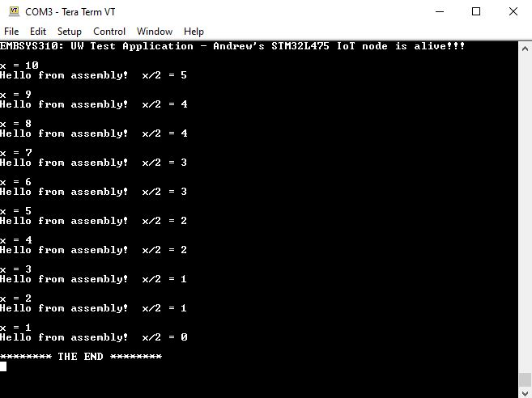

1a. The main function creates the variables x and y and stores values in them so that their addresses do not have to be manually created. Then, pointers are allocated to point to x and y's memory locations, which are then used in the swap-pointer function.

1b. When swap-pointer is called, R0 and R1 are 0x200003EC and 0x200003E8, which are xPtr and yPtr, respectively. These are stored in R0 and R1 because they are input arguments for the function that's being called, swap-pointer.

1c. 

2f. 

3c. 
